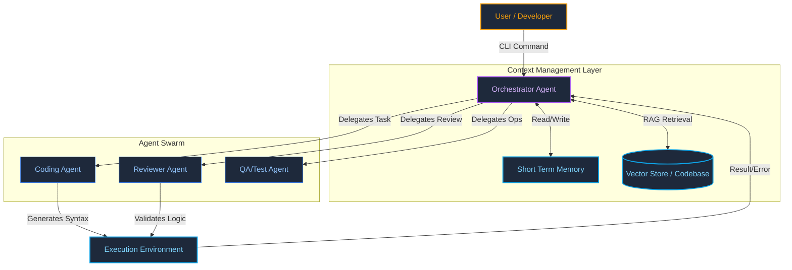

# JACQ: Multi-Agent Orchestration Environment

> **[Proprietary Architecture - Concept Whitepaper]**

JACQ is a "Cognitive Operating System" designed to solve context drift in complex logical tasks. It applies the rigors of **"Data Physics"** (strict schemas, type safety) to the probabilistic nature of LLMs.

## System Architecture

## Core Components

### 1. The Orchestrator
Acts as the system bus. It does not write code; it plans, delegates, and reviews. It maintains the "Thread State" ensuring that no context is lost between agent hand-offs.

### 2. Context Management
- **Short Term Memory:** Ephemeral scratchpad for the current task.
- **Long Term Memory:** Vector-based retrieval for codebase understanding and historical decisions.

### 3. Agent Swarm
Specialized agents with narrow prompts and tools:
- **Coder:** Pure generation.
- **Reviewer:** Linting, logic checking, and security validation.
- **QA:** Running tests and verifying acceptance criteria.
