<div align="center">
  
</div>

# JACQ Architecture
### Cognitive Operating System

> *A unified workspace where AI remembers, learns, and self-corrects.*

[](https://github.com/shifujosh/JACQ-Architecture/actions/workflows/ci.yml)
[](https://www.typescriptlang.org/)
[](https://nextjs.org/)
[](LICENSE)

[Architecture](#architecture) • [Key Innovations](#key-innovations) • [Documentation](#documentation) • [Examples](#examples)

</div>

---

## The Problem

AI tools today are **brilliant but forgetful**. 

Start a conversation, build deep context about your work, and then... it's gone. Every new session starts from zero. This "context amnesia" makes AI unreliable for complex, multi-step creative and technical work.

**The symptoms:**
- Repeating yourself across sessions ("Remember, I prefer TypeScript over JavaScript")
- Losing track of project decisions made weeks ago
- No continuity between research, writing, and creation
- AI that feels like a stranger, not a collaborator

## The Solution

**JACQ** gives AI **persistent memory** and the ability to **learn from past interactions**.

It is a workspace where I can research, write, code, and create visuals—all in one place. The system remembers past work, learns my preferences, and proactively suggests next steps. Outputs are verified before shipping, ensuring errors are caught, not propagated.

---

## Architecture

```mermaid
graph LR
    classDef human fill:#0f172a,stroke:#f59e0b,stroke-width:2px,color:#f59e0b;
    classDef core fill:#1e293b,stroke:#a855f7,stroke-width:2px,color:#d8b4fe;
    classDef memory fill:#1e293b,stroke:#10b981,stroke-width:2px,color:#6ee7b7;
    classDef work fill:#1e293b,stroke:#3b82f6,stroke-width:1px,color:#93c5fd;
    classDef output fill:#064e3b,stroke:#10b981,stroke-width:2px,color:#6ee7b7;

    User(["👤 User"]):::human
    
    subgraph Cognitive["Cognitive Layer"]
        Orchestrator{{"🧠 Orchestrator"}}:::core
        Memory[("Memory Graph")]:::memory
        Action["Action Engine"]:::core
    end
    
    subgraph Apps["App Federation"]
        Research["Research"]:::work
        Write["Write"]:::work
        Code["Code"]:::work
        Create["Create"]:::work
    end

    User ==> Orchestrator
    Memory -.->|"Context Injection"| Orchestrator
    Action -.->|"Suggestions"| User
    
    Orchestrator --> Research
    Orchestrator --> Write
    Orchestrator --> Code
    Orchestrator --> Create
    
    Research & Write & Code & Create --> Verify{{"✓ Verify"}}:::core
    Verify ==> Output["✅ Output"]:::output
    
    Output -.->|"Learning"| Memory
```



### Core Components

| Component | Purpose |
|-----------|---------|
| **Orchestrator** | Routes user intent to specialized apps. Manages session state and context injection. |
| **Memory Graph** | Persistent Entity-Fact knowledge graph. Enables semantic search and graph traversal. |
| **Action Engine** | Proactive intelligence. Analyzes patterns to suggest next actions. |
| **Verification** | Self-correction layer. Validates outputs before delivery. |

---

## Key Innovations

### 1. Graph-RAG Memory

Unlike flat context windows or simple vector stores, JACQ uses a **knowledge graph** with semantic retrieval:

```text
Entity (Person/Project/Concept) ──predicate──> Entity
Entity ──attribute──> Value
```

**Retrieval Strategy:**
1. **Vector Anchor** — Embed query, find semantically similar entities
2. **Spreading Activation** — Traverse N-hops to find connected context
3. **Narrative Construction** — Format subgraph for LLM injection

### 2. Staged Memory Lifecycle

Not all learned facts are equal. New inferences are "staged" before becoming permanent:

```text
staged ──(3+ accesses)──> confirmed ──(contradiction)──> superseded
                               └──(decay)──> retracted
```

- **Promotion:** Facts accessed 3+ times become confirmed
- **Decay:** Unused facts lose relevance exponentially over time
- **Conflict Resolution:** New high-confidence facts supersede old ones

### 3. Proactive Suggestions

The Action Engine doesn't wait for commands:
- Detects incomplete work sessions
- Suggests actions based on time patterns
- Adapts to usage frequency

---

## Technology Stack

| Layer | Technology | Rationale |
|-------|------------|-----------|
| **Framework** | Next.js 16 (App Router) | Server components, streaming, edge-ready |
| **Language** | TypeScript + Zod | Type safety from schema to runtime |
| **Memory Store** | DuckDB + VSS Extension | Embedded OLAP with vector search |
| **AI** | Google Gemini (2.5 Flash/Pro) | Fast inference with structured output |
| **Auth/User Data** | Firebase | Managed auth, Firestore for user data |

---

## Documentation

| Document | Description |
|----------|-------------|
| [Architecture](docs/ARCHITECTURE.md) | System overview, data flow, component details |
| [Memory Graph](docs/MEMORY_GRAPH.md) | Entity-Fact model, lifecycle, Graph-RAG retrieval |
| [ADR: Memory Backend](docs/adr/001-memory-graph-backend.md) | Why DuckDB over Neo4j |
| [ADR: Staging Policies](docs/adr/002-staging-policies.md) | Fact promotion and decay |
| [ADR: Graph-RAG](docs/adr/003-graph-rag-retrieval.md) | Retrieval strategy decisions |

---

## Examples

```bash
# Clone and install
git clone https://github.com/shifujosh/JACQ-Architecture.git
cd JACQ-Architecture
npm install

# Run the Graph-RAG demo
npx tsx examples/graph_rag_demo.ts

# Run tests
npm test
```

See [examples/](examples/) for complete demonstrations.


---

## Project Structure

```
JACQ-Architecture/
├── src/
│   ├── memory/           # Entity-Fact schema, staging policies
│   └── orchestrator/     # Intent routing, capability management
├── examples/             # Runnable demos
├── tests/                # Vitest test suite
├── docs/                 # Architecture documentation
│   └── adr/              # Architecture Decision Records
└── assets/               # Diagrams and visuals
```

---

## Philosophy

**"Stop Fraying. Start Finishing."**

JACQ is designed to reduce the cognitive overhead of context-switching. By maintaining persistent memory and proactively surfacing relevant information, it aims to keep creative and technical work in flow.

---

<div align="center">

**[Back to Profile](https://github.com/shifujosh)**

</div>
