# JACQ: Cognitive Operating System

> *A unified workspace where AI remembers, learns, and self-corrects.*

---

## The Problem

AI tools today are brilliant but forgetful. Start a conversation, build context, and then... it's gone. Every new session starts from zero. This "context amnesia" makes AI unreliable for complex, multi-step work.

## The Solution

JACQ gives AI persistent memory and the ability to learn from past interactions.

It is a workspace where I can research, write, code, and create visuals—all in one place. The system remembers past work, learns my preferences, and proactively suggests next steps.

---

## Core Capabilities

- **Persistent Memory:** Conversations and decisions are stored locally. Context builds over time.
- **Proactive Suggestions:** The system analyzes patterns and recommends next actions.
- **Self-Correction:** Outputs are verified before shipping. Errors are caught, not propagated.
- **Multi-Modal:** Text, code, and visuals flow into one another in a single canvas.

---

## Architecture

```mermaid
graph LR
    classDef human fill:#0f172a,stroke:#f59e0b,stroke-width:2px,color:#f59e0b;
    classDef core fill:#1e293b,stroke:#a855f7,stroke-width:2px,color:#d8b4fe;
    classDef work fill:#1e293b,stroke:#3b82f6,stroke-width:1px,color:#93c5fd;
    classDef output fill:#064e3b,stroke:#10b981,stroke-width:2px,color:#6ee7b7;

    User(["👤 User"]):::human
    Memory[(Memory)]:::work -.-> User
    
    User ==> Orchestrator{{"Orchestrator"}}:::core
    
    Orchestrator --> Research["Research"]:::work
    Orchestrator --> Write["Write"]:::work
    Orchestrator --> Code["Code"]:::work
    Orchestrator --> Create["Create"]:::work
    
    Research & Write & Code & Create --> Verify{"Verify"}:::core
    Verify ==> Output["✅ Output"]:::output
```

---

> **[Back to Profile](https://github.com/shifujosh)**
