# JACQ: The Magic Canvas

> *A personal AI operating system that remembers, learns, and self-corrects.*

---

## The Problem

AI tools today are brilliant but forgetful. You start a conversation, build context, and then... it's gone. Every new session starts from zero. This "context amnesia" makes AI unreliable for complex, multi-step work.

## The Solution

JACQ gives AI a persistent memory and the ability to fix its own mistakes.

It is a **local-first** workspace where I direct AI agents to research, write, code, and create visuals—all in a single fluid canvas. The system remembers past conversations, learns my preferences, and verifies its own outputs before shipping.

---

## How It Works

```mermaid
graph TD
    classDef conductor fill:#0f172a,stroke:#f59e0b,stroke-width:3px,color:#f59e0b;
    classDef ai fill:#1e293b,stroke:#a855f7,stroke-width:2px,color:#d8b4fe;
    classDef work fill:#1e293b,stroke:#3b82f6,stroke-width:1px,color:#93c5fd;
    classDef data fill:#1e293b,stroke:#0ea5e9,stroke-width:2px,color:#7dd3fc;

    You(["🎻 Conductor"]):::conductor ==>|Intent| Brain{{"Orchestrator"}}:::ai
    
    subgraph Memory ["🧠 Memory"]
        Short[(Short-Term)]:::data
        Long[(Long-Term)]:::data
    end
    
    Brain <-->|Read/Write| Memory
    
    subgraph Agents ["⚙️ Agents"]
        Brain -->|Code| Coder["Coder"]:::work
        Brain -->|Review| Reviewer["Reviewer"]:::work
        Brain -->|Test| QA["QA"]:::work
    end
    
    Coder & Reviewer & QA --> Output["✅ Verified Output"]:::work
```

**The key insight:** The Orchestrator does not write code. It *plans, delegates, and verifies*. This separation keeps the system reliable.

---

## Built With

- **TypeScript** — Core logic
- **DuckDB** — Local vector memory (no cloud dependency)
- **Playwright** — Automated end-to-end testing

---

> **[Back to Profile](https://github.com/shifujosh)**
