# JACQ Architecture

**JACQ** is a "Cognitive Operating System" designed to bridge the gap between ideation and execution. It uses a cyborg architecture where a central AI Agent (The Orchestrator) manages a federation of specialized apps and a persistent memory graph.

---

## System Overview

```mermaid
graph TD
    User["👤 User"] <--> UI["The Loom (UI)"]
    UI <--> Orchestrator["🧠 Orchestrator Agent"]

    subgraph "Cognitive Layer"
        Orchestrator <--> ActionEngine["Action Engine"]
        Orchestrator <--> MemoryGraph["Memory Graph"]
        MemoryGraph <--> Learning["Learning Pipeline"]
    end

    subgraph "App Federation"
        Orchestrator --> Editor["Editor App"]
        Orchestrator --> Browser["Browser/Tools"]
        Orchestrator --> Code["Code Studio"]
        Orchestrator --> Create["Media Studio"]
    end

    subgraph "Security Layer"
        API["API Gateway"] --> RateLimiter["Rate Limiter"]
        API --> InputSanitizer["Input Sanitizer"]
        API --> AuditLog["Audit Logger"]
    end

    User --> API
    API --> Orchestrator
```

---

## Core Components

### 1. The Orchestrator

The central nervous system. It manages:

- **Session State:** Chat history, active apps, and ephemeral "scratchpad" data.
- **Intent Routing:** Decides whether to answer a query, run a tool, or delegate to a sub-agent.
- **Context Injection:** Enriches user prompts with relevant data from the Memory Graph (Graph-RAG).

**Key Capabilities:**
- `RESEARCH` — Web search, document analysis
- `WRITE` — Content creation, editing
- `CODE` — Programming, debugging
- `CREATE` — Image/media generation
- `REMEMBER` — Memory storage/retrieval
- `REFLECT` — Self-analysis, planning

### 2. The Memory Graph

A persistent, self-organizing knowledge base.

- **Storage:** DuckDB (Local, Embedded)
- **Structure:** Entity-Fact Model (Nodes & Edges)
- **Retrieval (Graph-RAG):**
  1. **Vector Search:** Finds entry points (Anchors) using embeddings (HNSW Index)
  2. **Spreading Activation:** Traverses the graph to find connected context
  3. **Narrative Construction:** Formats the subgraph into natural language for the LLM

See [MEMORY_GRAPH.md](MEMORY_GRAPH.md) for complete documentation.

### 3. The Action Engine

Proactive intelligence that suggests next actions.

- **Function:** Analyzes user behavior and memory to predict intent
- **Time Awareness:** Suggests different actions based on time of day
- **Usage Learning:** Adapts to frequently used workflows
- **Output:** "Ignition Cards" — Suggested prompts/workflows presented in the UI

### 4. The Learning Pipeline

Background intelligence that extracts knowledge from conversations.

- **Entity Extraction:** Identifies people, projects, concepts, decisions, preferences
- **Fact Staging:** New facts start as "staged" and promote on reuse
- **Conflict Resolution:** High-confidence new facts supersede old contradictions
- **Maintenance:** Periodic decay and cleanup of stale facts

### 5. Security Layer

Defense-in-depth for the AI era.

- **Input Sanitization:** Strips prompt injection vectors and malicious payloads
- **Rate Limiting:** Per-user sliding window with endpoint-specific limits
- **Audit Logging:** Immutable log of security-relevant events

---

## Data Flow

### The Chat / RAG Loop

### Key Phases

1. **Authentication & Sanitization**
   - Verify Bearer token
   - Check rate limits
   - Strip injection attempts

2. **Context Retrieval**
   - Generate embedding for user message
   - Find semantically similar entities (Vector Anchor)
   - Traverse graph to build context subgraph
   - Format as natural language for injection

3. **AI Processing**
   - Build system prompt with context
   - Stream response from LLM
   - Handle structured output if needed

4. **Background Learning**
   - Extract entities and facts from conversation
   - Check for conflicts with existing facts
   - Stage new knowledge
   - Run maintenance (decay/promotion)

---

## Design Principles

### Local-First

User data stays on the user's machine. The memory graph is an embedded DuckDB database, requiring no external servers or cloud dependencies for storage.

### Autonomous Maintenance

The system is self-cleaning. Background loops handle:
- **Promotion:** Frequently accessed staged facts become confirmed
- **Decay:** Unused facts lose relevance over time
- **Conflict Resolution:** New authoritative facts supersede old

### Graceful Degradation

If any component fails:
- Memory retrieval falls back to keyword search
- Learning pipeline logs errors but doesn't block responses
- Rate limiting is permissive by default

---

## Technology Stack

| Component | Technology | Notes |
|-----------|------------|-------|
| **Framework** | Next.js 16 (App Router) | Server components, streaming |
| **Language** | TypeScript | Strict mode, Zod validation |
| **Database** | DuckDB + VSS Extension | Embedded OLAP with vector search |
| **AI Models** | Google Gemini 2.5 | Flash for speed, Pro for quality |
| **User Data** | Firebase | Auth, Firestore for user profiles |
| **Testing** | Vitest + Playwright | Unit and E2E coverage |
| **Styling** | Tailwind CSS 4 | Design system tokens |

---

## Related Documentation

- [Memory Graph](MEMORY_GRAPH.md) — Entity-Fact model and Graph-RAG
- [ADR: Memory Backend](adr/001-memory-graph-backend.md) — Why DuckDB
- [ADR: Staging Policies](adr/002-staging-policies.md) — Fact lifecycle
- [ADR: Graph-RAG](adr/003-graph-rag-retrieval.md) — Retrieval strategy
