# Memory Graph

The **Memory Graph** is the long-term memory of JACQ. It allows the system to remember people, projects, technical preferences, and past decisions, creating a continuous and personalized experience.

---

## Conceptual Model

The memory is modeled as a **Knowledge Graph**, implemented on top of relational tables with vector extensions.

```mermaid
graph LR
    subgraph Entities["Entities (Nodes)"]
        User["👤 User"]
        Project["📁 JACQ"]
        Concept1["💡 TypeScript"]
        Concept2["💡 DuckDB"]
        Person["👤 Sarah"]
    end

    subgraph Facts["Facts (Edges)"]
        User -->|"works_on"| Project
        Project -->|"uses"| Concept1
        Project -->|"uses"| Concept2
        User -->|"knows"| Person
        User -->|"prefers: dark mode"| User
    end
```



### Entities (Nodes)

Represent distinct "things" in the user's world.

| Field | Type | Description |
|-------|------|-------------|
| `id` | UUID | Unique identifier |
| `type` | Enum | `person`, `project`, `concept`, `decision`, `preference` |
| `name` | String | Display name (e.g., "React", "Sarah") |
| `aliases` | String[] | Alternative references (e.g., ["React.js", "ReactJS"]) |
| `embedding` | Float[768] | Vector for semantic search |
| `mentionCount` | Int | Number of times referenced |
| `lastMentioned` | Timestamp | Recency tracking |

### Facts (Edges/Attributes)

Represent relationships or properties.

| Field | Type | Description |
|-------|------|-------------|
| `id` | UUID | Unique identifier |
| `subjectId` | UUID | The entity this fact is about |
| `predicate` | String | Relationship type (e.g., "uses", "prefers", "knows") |
| `objectId` | UUID? | Target entity (for relationships) |
| `objectValue` | String? | Literal value (for attributes) |
| `confidence` | Float | 0.0 - 1.0 certainty score |
| `status` | Enum | Lifecycle state (see below) |
| `source` | Enum | How this fact was learned |
| `accessCount` | Int | Usage tracking for promotion |
| `lastAccessed` | Timestamp | Recency for decay |

---

## The Fact Lifecycle

Facts are not static; they evolve through a lifecycle to ensure the memory stays relevant and accurate.


### Status Descriptions

| Status | Description | Behavior |
|--------|-------------|----------|
| **Staged** | Newly learned, on probation | Included in context if relevant, but with lower weight |
| **Confirmed** | Validated through repeated access | Full weight in context, resistant to decay |
| **Superseded** | Replaced by newer conflicting fact | Kept for history, excluded from active queries |
| **Retracted** | Explicitly removed or decayed | Eligible for cleanup |

### Promotion Rules

A staged fact is promoted to confirmed when:
```
accessCount >= PROMOTION_THRESHOLD (default: 3)
```

### Decay Formula

Relevance is calculated as:
```typescript
relevance = confidence * sourceWeight * decayFactor * usageBoost

where:
  sourceWeight = { user_edit: 2.0, file: 1.5, system: 1.2, conversation: 1.0 }
  decayFactor  = 0.95 ^ weeksSinceAccess  // 5% decay per week after grace period
  usageBoost   = 1 + (log10(accessCount + 1) * 0.5)  // Mild boost for usage
```

### Conflict Resolution

When a new high-confidence fact contradicts an existing one:
1. If `newFact.confidence > 0.9` and `newFact.value != existingFact.value`
2. The existing fact is marked `superseded` with `validUntil = now`
3. The new fact takes precedence in future queries

Example:
```
Existing: User -> lives_in -> "NYC" (confidence: 0.8)
New:      User -> lives_in -> "SF"  (confidence: 0.95)
Result:   NYC fact superseded, SF fact staged
```

---

## Graph-RAG Retrieval

We use a "Graph-RAG" approach to provide rich context to the AI, combining vector search with graph traversal.

### Retrieval Pipeline


### Step 1: Vector Anchor

The user's query is embedded, and we search for the top 3 semantically similar Entities using HNSW index.

```sql
SELECT id, name, type
FROM entities
WHERE user_id = ?
ORDER BY vec_cosine_distance(embedding, ?) ASC
LIMIT 3
```

### Step 2: Spreading Activation

We traverse the graph starting from anchor entities, following relationships up to N hops deep (default: 2).

```typescript
function traverse(startIds: string[], maxHops: number): Fact[] {
  const visited = new Set<string>();
  const facts: Fact[] = [];
  let frontier = startIds;

  for (let hop = 0; hop < maxHops; hop++) {
    const newFrontier: string[] = [];
    
    for (const entityId of frontier) {
      if (visited.has(entityId)) continue;
      visited.add(entityId);
      
      const connectedFacts = getFactsForEntity(entityId);
      facts.push(...connectedFacts);
      
      // Add connected entities to next frontier
      for (const fact of connectedFacts) {
        if (fact.objectId) newFrontier.push(fact.objectId);
      }
    }
    
    frontier = newFrontier;
  }
  
  return facts;
}
```

### Step 3: Relevance Scoring

Each fact is scored based on:

| Factor | Weight | Description |
|--------|--------|-------------|
| Confidence | 1x | Base certainty of the fact |
| Source | 0.5-2x | User edits weighted higher than inference |
| Time Decay | 0.5-1x | Recent facts weighted higher |
| Usage Boost | 1-2x | Frequently accessed facts weighted higher |

### Step 4: Narrative Construction

The highest-scoring subgraph is formatted into natural language for the LLM's system prompt:

```markdown
### 👤 USER CONTEXT
- prefers: dark mode
- works_on: JACQ Project
- uses: TypeScript

### 💡 CONTEXT: JACQ Project
- uses: DuckDB
- uses: Next.js
- status: active development
```

---

## Autonomy & Maintenance

The system is self-cleaning. A background "Maintenance Loop" runs after conversations:

### Promotion Pass
```typescript
// Find staged facts with enough accesses
const stagedFacts = await getFactsByStatus('staged');
for (const fact of stagedFacts) {
  if (shouldPromote(fact)) {
    await updateFactStatus(fact.id, 'confirmed');
  }
}
```

### Decay Pass
```typescript
// Reduce relevance of old, unused facts
const allFacts = await getAllFacts();
for (const fact of allFacts) {
  const newRelevance = calculateRelevance(fact);
  if (newRelevance < CLEANUP_THRESHOLD) {
    await updateFactStatus(fact.id, 'retracted');
  }
}
```

### Conflict Resolution
```typescript
// Check new high-confidence facts against existing
if (newFact.confidence > 0.9) {
  const existing = await getFactsForEntity(subjectId, predicate);
  for (const old of existing) {
    if (old.value !== newFact.value) {
      await supersedeFact(old.id);
    }
  }
}
```

---

## Configuration

Default staging policy values:

| Parameter | Default | Description |
|-----------|---------|-------------|
| `PROMOTION_THRESHOLD` | 3 | Accesses to promote staged → confirmed |
| `DECAY_GRACE_PERIOD_DAYS` | 7 | Days before decay starts |
| `DECAY_RATE` | 0.95 | Weekly decay multiplier (5% per week) |
| `CLEANUP_THRESHOLD` | 0.2 | Relevance below which facts are retracted |
| `MIN_ACCESS_PROTECTION` | 5 | High-usage facts protected from cleanup |

---

## Related Documentation

- [Architecture](ARCHITECTURE.md) — System overview
- [ADR: Memory Backend](adr/001-memory-graph-backend.md) — Why DuckDB
- [ADR: Staging Policies](adr/002-staging-policies.md) — Policy decisions
